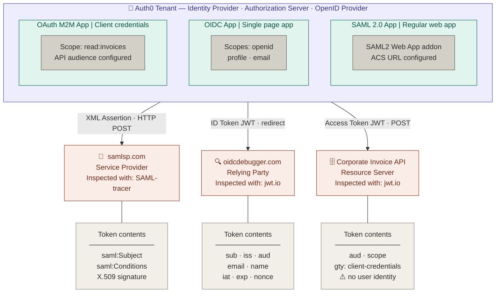

# 🔐 Identity & Access Management Protocol Lab — Auth0 (SAML | OIDC | OAuth 2.0)

> A hands-on identity and access management (IAM) lab configuring and implementing all three major authentication and authorization protocols using **Auth0** as a live identity provider — with real token inspection, metadata exchange, and protocol-level debugging.

<br>

## 📋 Table of Contents

- [Lab 1 — SAML 2.0 Enterprise SSO](#lab-1--saml-20-enterprise-sso)
- [Lab 2 — OpenID Connect OIDC](#lab-2--openid-connect-oidc)
- [Lab 3 — OAuth 2.0 Machine-to-Machine](#lab-3--oauth-20-machine-to-machine)
- [Protocol Comparison](#protocol-comparison)
- [Tools Used](#tools-used)
- [Prerequisites](#prerequisites)
- [Skills Demonstrated](#skills-demonstrated)

<br>

## Lab Overview

| Lab | Protocol | Purpose | Inspected With |
|-----|----------|---------|----------------|
| Lab 1 | **SAML 2.0** | Enterprise SSO (SP-Initiated flow) | SAML-tracer browser extension |
| Lab 2 | **OpenID Connect** | Modern web/mobile authentication | jwt.io token decoder |
| Lab 3 | **OAuth 2.0 (M2M)** | Machine-to-machine authorization | Hoppscotch API client + jwt.io |

Everything runs in the browser using the Auth0 free tier.

<br>


<br>


## 🧪 Architecture Overview
 


<br>

## Lab 1 — SAML 2.0 Enterprise SSO

### What Is SAML?

SAML (Security Assertion Markup Language) is the standard behind enterprise SSO. It uses signed **XML assertions** to communicate identity between two parties:

- **Identity Provider (IdP):** Auth0 — stores users and issues assertions
- **Service Provider (SP):** The application users are trying to access

Trust is established through a **Metadata Exchange** — an XML file containing certificates, endpoints, and entity IDs that both sides share.

---

### Step-by-Step: What Was Configured

**Step 1 — Prepare the Service Provider**

Navigate to [samlsp.com](https://samlsp.com) and collect:
- `Assertion Consumer Service URL (ACS)` — where Auth0 sends the SAML response
- `Audience (Entity ID)` — the SP's unique identifier

**Step 2 — Configure Auth0 as the IdP**

1. Auth0 Dashboard → **Applications** → **Create Application**
2. Name: `SAML Testing SP` | Type: `Regular Web Application`
3. Open the **Addons** tab → enable **SAML2 Web App**
4. Paste the **ACS URL** into the `Application Callback URL` field
5. Click **Enable**

**Step 3 — Metadata Exchange**

1. In Auth0 SAML settings → **Usage** tab → download **Identity Provider Metadata** (`.xml`)
2. Upload the XML file to samlsp.com under **"Configuration parameters from your IdP"**
3. The tool auto-parses: **IdP Entity ID**, **Login URL**, **X.509 Certificate**

> This is exactly how enterprise integrations work. The same XML metadata file you export from Auth0 is what you would import into Salesforce, Workday, or ServiceNow.

**Step 4 — Trigger the Flow and Inspect the Assertion**

1. Open the **SAML-tracer** extension (ensure it is capturing)
2. Click **Login** on samlsp.com
3. Authenticate via Auth0
4. Find the HTTP `POST` request highlighted in **orange** in SAML-tracer → click the **SAML** tab


---

### What the SAML Assertion Looks Like

```xml
<samlp:Response xmlns:samlp="urn:oasis:names:tc:SAML:2.0:protocol">
  <saml:Assertion xmlns:saml="urn:oasis:names:tc:SAML:2.0:assertion">

    <saml:Issuer>
      <!-- Auth0's Entity ID — proves who signed this -->
      https://dev-xxxx.us.auth0.com/
    </saml:Issuer>

    <saml:Subject>
      <saml:NameID Format="urn:oasis:names:tc:SAML:1.1:nameid-format:emailAddress">
        user@example.com
      </saml:NameID>
    </saml:Subject>

    <saml:Conditions
      NotBefore="2025-01-01T00:00:00Z"
      NotOnOrAfter="2025-01-01T01:00:00Z">
      <!-- Time-bounded validity window -->
    </saml:Conditions>

    <saml:AttributeStatement>
      <saml:Attribute Name="email">
        <saml:AttributeValue>user@example.com</saml:AttributeValue>
      </saml:Attribute>
    </saml:AttributeStatement>

  </saml:Assertion>
</samlp:Response>
```

### Key Takeaways

- The SAML Response is **Base64-encoded XML** delivered via HTTP POST
- The `<saml:Subject>` block contains the authenticated user's identity
- The assertion is **cryptographically signed** — the SP validates the signature using the X.509 certificate from the metadata file
- This SP-Initiated flow (SP redirects to IdP → IdP POSTs assertion back to SP's ACS URL) is the dominant enterprise SSO pattern used in production

<br>

## Lab 2 — OpenID Connect OIDC

### What Is OIDC?

OpenID Connect is an identity layer built directly on top of OAuth 2.0. Where SAML relies on XML, OIDC uses lightweight **JSON Web Tokens (JWTs)**. It is the modern standard for web and mobile authentication.

Two parties:
- **OpenID Provider (OP):** Auth0
- **Relying Party (RP):** The application requesting identity

---

### Step-by-Step: What Was Configured

**Step 1 — Configure Auth0 as the OpenID Provider**

1. Auth0 Dashboard → **Applications** → **Create Application**
2. Name: `OIDC Testing App` | Type: `Single Page Web Application`
3. Under **Settings** — note your **Domain** and **Client ID**
4. Add to **Allowed Callback URLs**: `https://oidcdebugger.com/debug`
5. Click **Save Changes**

**Step 2 — Configure the Relying Party**

Navigate to [oidcdebugger.com](https://oidcdebugger.com) and fill in:

| Field | Value |
|-------|-------|
| Authorize URI | `https://YOUR_DOMAIN/authorize` |
| Redirect URI | `https://oidcdebugger.com/debug` |
| Client ID | *(from Auth0 Settings tab)* |
| Scope | `openid profile email` |
| Response type | `id_token` |

**Step 3 — Authenticate and Decode**

1. Click **Send Request** — redirected to Auth0
2. Log in and **Accept** the permissions prompt
3. Copy the **ID Token** (the large green string on the success screen)
4. Paste it at [jwt.io](https://jwt.io) → inspect the **Decoded** payload on the right

---

### ID Token (JWT) — Decoded Payload

```json
{
  "sub": "auth0|64f3c2a1b8e9d00012345678",
  "iss": "https://dev-xxxx.us.auth0.com/",
  "aud": "YOUR_CLIENT_ID",
  "email": "user@example.com",
  "name": "Test User",
  "iat": 1234567890,
  "exp": 1234571490,
  "nonce": "abc123xyz"
}
```

| Claim | Meaning |
|-------|---------|
| `sub` | Subject — the unique, stable user identifier |
| `iss` | Issuer — the Auth0 domain that signed this token |
| `aud` | Audience — the Client ID this token was issued for |
| `email` | Returned because `email` was in the requested scope |
| `iat` / `exp` | Issued at / Expires at — JWT validity window |
| `nonce` | One-time value — prevents replay attacks |

### Key Takeaways

- No XML, no metadata files, no certificates to manually exchange
- Scopes (`openid profile email`) tell the IdP exactly what the app is allowed to request — nothing more is returned
- The JWT is **self-contained** — the RP can verify it using Auth0's public JWKS endpoint without calling Auth0 again at runtime
- The `nonce` in the payload must match what the RP sent in the request, preventing token replay

---

### SAML vs OIDC — Side by Side

| | SAML 2.0 | OpenID Connect |
|---|---|---|
| Token format | XML Assertion (Base64-encoded) | JSON Web Token (JWT) |
| Trust setup | Metadata XML exchange | Client ID + secret |
| Signature verification | X.509 certificate from metadata | JWKS endpoint (public key) |
| Verbosity | Heavy — kilobytes of XML | Lightweight — compact JSON |
| Primary use case | Legacy enterprise SaaS | Web apps, mobile apps, APIs |
| Inspector tool | SAML-tracer | jwt.io |

<br>

## Lab 3 — OAuth 2.0 Machine-to-Machine

### What Is OAuth 2.0?

> **The golden rule of IAM:**
> **OIDC = Authentication** (who are you?)
> **OAuth 2.0 = Authorization** (what are you allowed to do?)

OAuth 2.0 is not an identity protocol — it is an **access delegation** framework. Think of it like a hotel keycard: the keycard opens Room 402, but it does not know your name.

This lab demonstrates the **Client Credentials flow** — how backend services talk to each other securely **without a user involved at all**.

Four roles in the OAuth 2.0 framework:

| Role | In This Lab |
|------|-------------|
| Resource Owner | The organization owning the invoice data |
| Client | The M2M backend application |
| Authorization Server | Auth0 |
| Resource Server | Corporate Invoice API |

---

### Step-by-Step: What Was Configured

**Step 1 — Create the API (Resource Server)**

1. Auth0 Dashboard → **Applications** → **APIs** → **Create API**
2. Name: `Corporate Invoice API`
3. Identifier (Audience): `https://api.mycompany.com/invoices`
4. Click **Create**
5. Go to the **Permissions** tab → add scope: `read:invoices` with a description

**Step 2 — Authorize the M2M Client**

1. Inside the API → **Machine to Machine Applications** tab
2. Toggle **Authorized** on the auto-created Test Application
3. Check `read:invoices` in the scopes popup → **Update**

**Step 3 — Request the Access Token via Hoppscotch**

Navigate to [hoppscotch.io](https://hoppscotch.io) and configure:

- Method: `POST`
- URL: `https://YOUR_DOMAIN/oauth/token`
- Body Content Type: `application/json`

```json
{
  "client_id":     "YOUR_CLIENT_ID",
  "client_secret": "YOUR_CLIENT_SECRET",
  "audience":      "https://api.mycompany.com/invoices",
  "grant_type":    "client_credentials"
}
```

Click **Send** — copy the `access_token` from the JSON response.

**Step 4 — Decode and Analyze at jwt.io**

Paste the token into the **Encoded** box. The critical observation is in the payload.

---

### Access Token (JWT) — Decoded Payload

```json
{
  "iss": "https://dev-xxxx.us.auth0.com/",
  "sub": "YOUR_CLIENT_ID@clients",
  "aud": "https://api.mycompany.com/invoices",
  "iat": 1234567890,
  "exp": 1234571490,
  "scope": "read:invoices",
  "gty": "client-credentials"
}
```

> **No `email`. No user `name`. No personal identity claims.** This token grants a machine access to a resource — it says nothing about who a human is. This is the fundamental, protocol-level difference between OAuth 2.0 and OIDC.

| Claim | Meaning |
|-------|---------|
| `aud` | Audience — scoped directly to the Invoice API |
| `scope` | `read:invoices` — exactly what was granted, nothing more |
| `sub` | The **client application** ID, not a human user |
| `gty` | Grant type — `client-credentials` confirms M2M flow |

### Key Takeaways

- The `scope` is the keycard — it enforces **principle of least privilege** at the protocol level
- The `aud` claim ties the token to a specific API — a token minted for the Invoice API is cryptographically invalid against any other API
- The Resource Server validates the token using Auth0's JWKS public keys — no runtime callback to Auth0 is needed
- This is the foundation of microservice-to-microservice authentication in production cloud environments (AWS, Azure, GCP all use this pattern)

<br>

## Protocol Comparison

| | SAML 2.0 | OpenID Connect | OAuth 2.0 |
|---|---|---|---|
| **Category** | Authentication | Authentication | Authorization |
| **Token format** | XML Assertion | JWT (ID Token) | JWT (Access Token) |
| **Contains user identity** | ✅ Yes | ✅ Yes | ❌ No |
| **Setup mechanism** | Metadata XML exchange | Client ID + JWKS | Client ID + secret |
| **Transport** | HTTP POST (Base64 XML) | HTTP redirect + JSON | HTTP POST (JSON) |
| **Verbosity** | Heavy | Lightweight | Lightweight |
| **Best for** | Enterprise SaaS SSO | Web / mobile login | API access, M2M |
| **Real-world examples** | Salesforce, Workday, ServiceNow | Google, GitHub, Okta | Stripe, AWS, Twilio APIs |
| **Inspected with** | SAML-tracer | jwt.io | jwt.io + Hoppscotch |

<br>

## Tools Used

| Tool | Role in Lab | Link |
|------|-------------|------|
| **Auth0** | Identity Provider / Authorization Server | [auth0.com](https://auth0.com) |
| **samlsp.com** | SAML Service Provider (SP) test tool | [samlsp.com](https://samlsp.com) |
| **SAML-tracer** | Browser extension — captures live SAML HTTP POST | [Chrome Web Store](https://chromewebstore.google.com/detail/mpdajninpobndbfcldcmbpnnbhibjmch) |
| **oidcdebugger.com** | OIDC Relying Party test tool | [oidcdebugger.com](https://oidcdebugger.com) |
| **jwt.io** | JWT decoder — inspect claims in ID and access tokens | [jwt.io](https://jwt.io) |
| **Hoppscotch** | Web-based API client — fires the token request POST | [hoppscotch.io](https://hoppscotch.io) |

<br>

## Prerequisites

- A free [Auth0 account](https://auth0.com) — no credit card required, works with any personal email
- The [SAML-tracer](https://chromewebstore.google.com/detail/mpdajninpobndbfcldcmbpnnbhibjmch) browser extension (Chrome or Firefox)
- Any modern browser with developer tools
- Bookmarks for [jwt.io](https://jwt.io) and [hoppscotch.io](https://hoppscotch.io)

<br>

## Skills Demonstrated

- Identity Provider (IdP) configuration and Auth0 tenant management
- SAML 2.0 SP-Initiated SSO — metadata exchange, ACS URL configuration, XML assertion inspection
- OpenID Connect Implicit Flow — scope-based claim requests, JWT structure and claim mapping, JWKS verification model
- OAuth 2.0 Client Credentials (M2M) — API resource server creation, scope-based access control, access token claim analysis
- Protocol-level token decoding and claim-by-claim comparison across SAML, OIDC, and OAuth 2.0
- Understanding of the authentication vs. authorization distinction at the implementation level

<br>

## Related Certifications

| Certification | Relevance |
|---------------|-----------|
| **SC-300** — Microsoft Identity and Access Administrator | Core exam topic: SAML, OIDC, OAuth 2.0, Entra ID federation |
| **CompTIA Security+** | IAM, SSO, federation protocols, token-based authentication |
| **Okta Certified Professional** | Identity provider concepts, SAML and OIDC integration patterns |

<br>

---

*Lab built using the Auth0 free tier. All credentials used were sandbox/test values — no production secrets were involved.*
